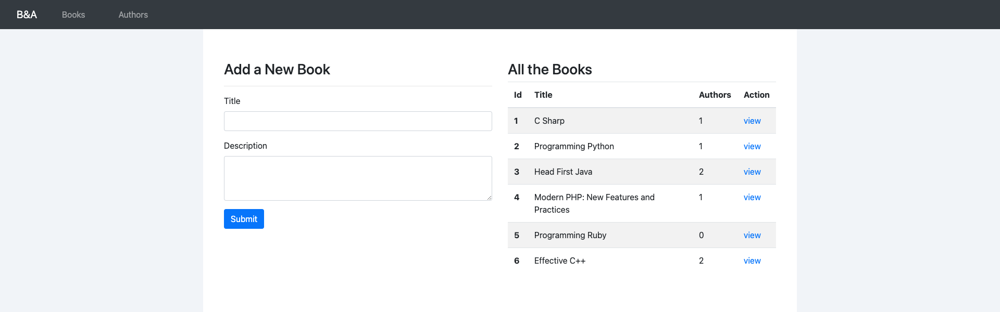
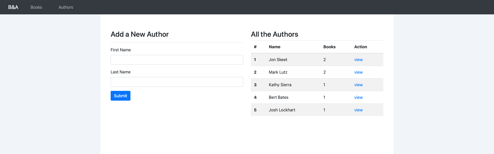
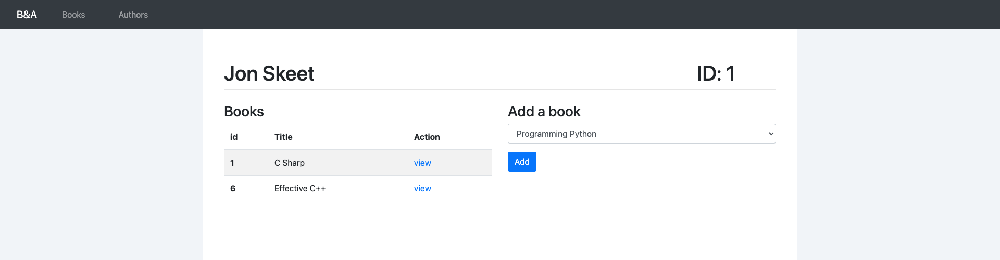
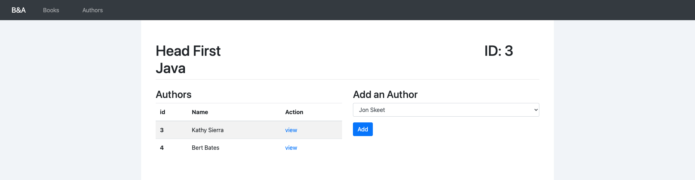

# :computer: Books & Authors
This is a webpage that allows users to add the titles of books and th the names of authors to a database. The books and the authors have a many to many relation, meaning one book
can have multiple authors and an author can have multiple books that they have written. The home page shows all the books that are in the database and clicking on
one of the books will lead a user the book's page which has more details about the book. A user can also click on the authors page and see all the authors in the databse 
alongside the amount of books the author has written. Clicking on the author will direct a user to that author's page and show the books they have written.

# :pencil2: What I learned  
  * Django
  * Models
  * Sqlite
  * Many to Many

# :camera: Screenshots

